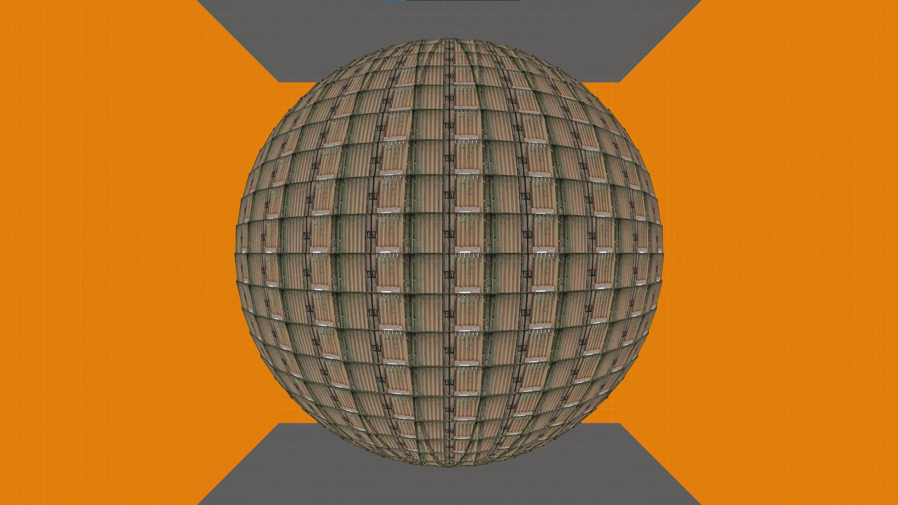
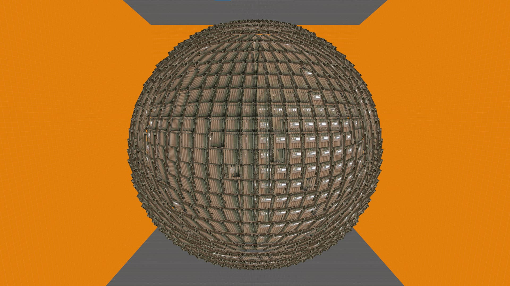
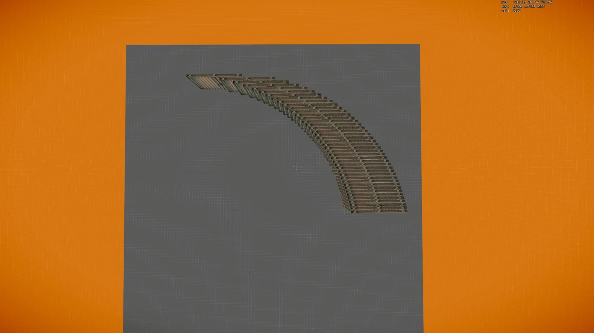
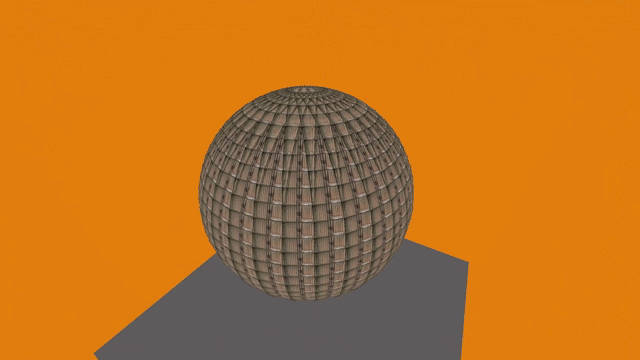

# Sphere-Script-Generator

Sphere-Script-Generator is a GUI tool which lets users create custom scripts for sphere generation in Source Engine, utilising its scripting capabilities. Done with Python and Tkinter.

It uses sphere equation for calculating coordinates and angles and converts it into a large sets of Source Engine readable commands for execution. Config files are created by linking a number of those commands into larger chunks which execute the next one at the end as to not exceed the config length and size limit.

With that being said, keep in mind as to not go crazy with the size of the sphere in order to not run into free edicts and heap memory limits of the Engine. The simpler the map, the denser the sphere can be.

You can use the map attached in the repo for testing the spheres in HL2DM (HL2 and Synergy should also be fine). For other Source Engine titles, you'd need to compile a map yourself with appropriate spawn entities.
 
# Download
To download this project use the *git clone* command from the terminal:
```bash
$ git clone https://github.com/Sanubir/Sphere-Script-Generator.git
```
or use the "Download ZIP" option from the [Github](https://github.com/Sanubir/Sphere-Script-Generator) page and extract the files once downloaded.

# Requirements
 * [Python](https://www.python.org/)
 * Tkinter (should be available in a default Python installation)

To check if Tkinter is installed run the this from the terminal:
```bash
$ python3 -m tkinter
```

If there are no errors you are good to go.
If Tkinter is not available you'll have to install it per your OS.

# Quick Setup
Run the project by 'cd-ing' into the *Sphere-Script-Generator/* directory and using the *python3* command from the terminal:
```bash
$ cd Sphere-Script-Generator/
$ python3 ui.py
```

# Examples of a generated sphere








_Please notice this repository is a temporary showcase, which should be polished within the next days._
